<h1>2019 - UTN FRA - 2 cuatrimestre - PPS -- La Comanda -- Equipo Gamma</h1>
<h3>Para registrarse: https://forms.gle/MQudzzZkWsfpihy27</h3>

 
<h1>La Comanda</h1>

 
<h3>Integrantes</h3>
<ul>
  <li>Augusto Morelli</li>
  <li>Marcos Cardona</li>
  <li>Gastón Pesoa</li>
</ul>
<h3>Profesor</h3>
<ul>
  <li>Maximiliano Neiner</li>
</ul>

 

Se utilizará github para el trabajo en equipo. Creando una rama para cada integrante que luego se fusionarán para integrar los cambios.

La planificación y registro de tareas realizadas quedará registrado en este <a href="https://docs.google.com/spreadsheets/d/1Hso0U6gmNq-NEFsZ7tdsMgobRnvUpk5OAh_aCR_QS04/edit#gid=1587683816">Excel</a>.

 
<h3>Descripción del negocio:</h3>

Sistema de servicio de pedidos para restaurante, con dos sectores bien diferenciados:

<ul>
   <li>la barra de tragos y vinos</li>
   <li>cocina, donde se preparan todos los platos de comida</li>
</ul>

Dentro del de trabajadores tenemos empleados diferenciados por

<ul>
   <li>socios/dueños​</li>
   <li>bartender​</li>
   <li>cocineros​</li>
   <li>mozos​</li>
</ul>

Además el ingreso como cliente registrado, anónimo y el administrador.

<h3>Gestión de Comandas</h3>

Cada comanda tiene toda la información necesaria, incluso el nombre del cliente, y es vista por el empleado correspondiente

<b>Operatoria principal:</b>

<ul>
   <li>El cliente ingresa al local y se pone en la lista de espera.</li>
   <li>El mozo rechaza o acepta al cliente y le asigna una mesa.</li>
   <li>El cliente puede ver su mesa asignada y generar un pedido.</li>
   <li>El cliente puede realizar la encuesta de satisfacción.</li>
   <li>El mozo acepta o rechaza el pedido.</li>
   <li>El barman y el cocinero visualizan en su lista de pendientes los menus del pedido que le correspondan.</li>
   <li>El barman y el cocinero toman el pedido.</li>
   <li>El cliente puede visualizar la hora de entrega.</li>
   <li>El barman y el cocinero terminan el pedido.</li>
   <li>El mozo entrega el pedido.</li>
   <li>El cliente confirma la recepción del pedido y puede pagar.</li>
   <li>El cliente paga.</li>
   <li>El mozo confirma el pago, cierra el pedido y libera la mesa.</li>
</ul>

<b>La encuesta de satisfacción califica:</b>

<ul>
   <li>El servicio</li>
   <li>La comida</li>
   <li>La mesa</li>
</ul>

Y un breve texto con comentarios adicionales.

 
<h3>Descripción técnica:</h3>

Aplicación móvil, desarrollada con Ionic Framework 4 integrado con Angular y plugins Cordova para agregar funcionalidad nativa. Como motor de base de datos se utiliza Firebase, para persistir la información.

<h3>Modelo de datos:</h3>

<ul>
   <li>
      
<b>Usuarios</b>

      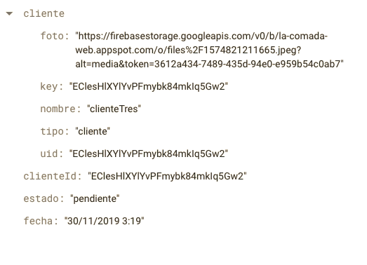
   </li>
   <li>
      
<b>Mesas</b>

      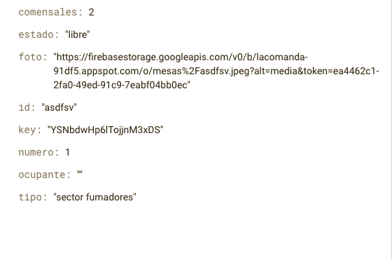
   </li>
   <li>
      
<b>Menus</b>

      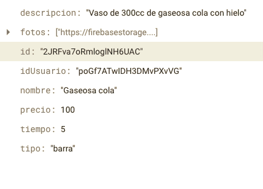
   </li>
   <li>
      
<b>Pedidos</b>

      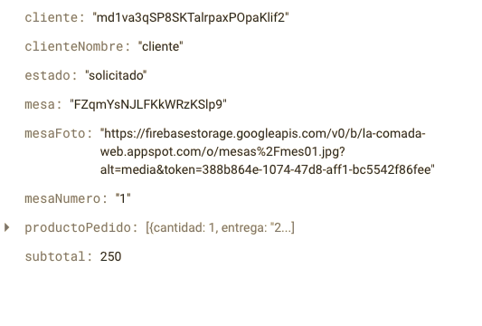
   </li>
   <li>
      
<b>Encuestas</b>

      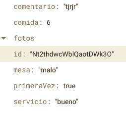
   </li>
</ul>

<h3>Instalación:</h3>
<ul>
   <li>Clonar proyecto con github 
    <b>git clone https://github.com/gastonpesoa/2019_TP_PPS_Comanda_2_cuatri.git</b>
   </li>
   <li>Instalar Ionic y Cordova 
    <b>npm install -g ionic cordova</b>
   </li>
   <li>Instalar Node.js 
    <b>https://nodejs.org/en/</b>
   </li>
   <li>Abrir el proyecto e instalar librerías 
      <b>npm install</b>
   </li>
   <li>Correr la aplicación en localhost 
    <b>ionic serve</b>
   </li>
   <li>Dirigirse a 
    <b>http://localhost:8100/</b>
   </li>
</ul>

Para la instalación nativa en Android: <a href="https://github.com/gastonpesoa/2019_TP_PPS_Comanda_2_cuatri/blob/master/app-debug.apk">descargar apk</a> e instalar

 

<b>
Sprint 1 26/10 - 2/11
</b>
<ol>
  <li>Generación de repositorio</li>
  <li>Creación de estructura general de la aplicacion - Augusto Morelli - master</li>
  <li>Home - Gastón Pesoa - gaston</li>
  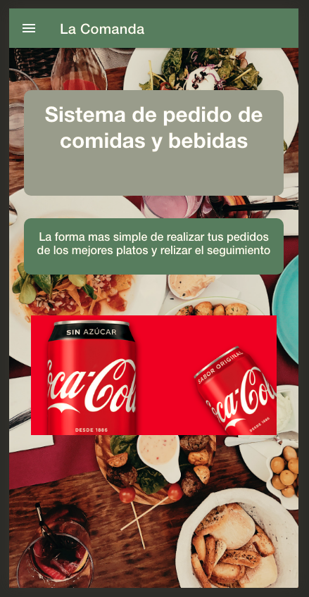
  <li>Login - Augusto Morelli - master</li>
  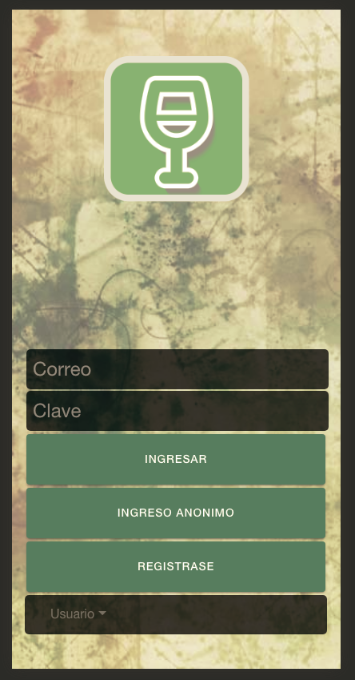
  <li>Registro de cliente - Augusto Morelli - augustoBranch</li>
  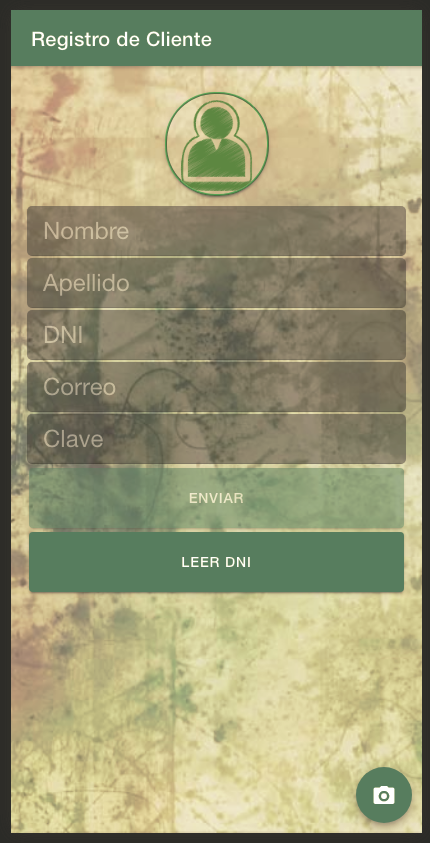
  <li>Icono - Augusto Morelli - master</li>
  
  <li>Splash Screen animado con Logo de la aplicación - Gastón Pesoa - gaston</li>
  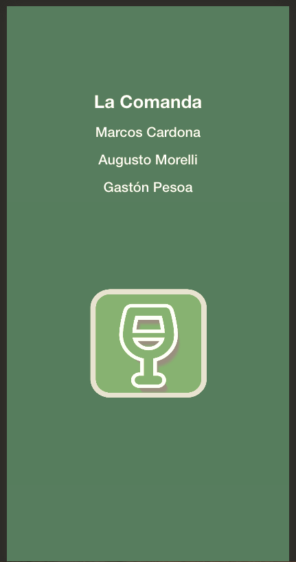
  <li>Menu Layout - Gastón Pesoa - gaston</li>
  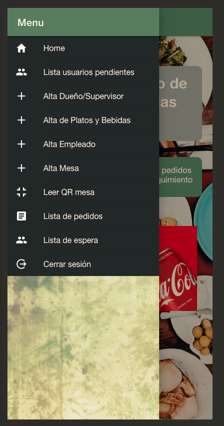
  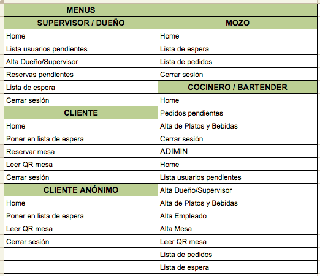
  <li>Configuración de Servicios
    <ul>
    <li>Firebase - Marcos Cardona - marcos</li>
    <li>Barcode - Gastón Pesoa - gaston</li>
    <li>QR - Gastón Pesoa - gaston</li>
    <li>Camara - Gastón Pesoa - gaston</li>
    <li>Spinner - Gastón Pesoa - gaston</li>
    <li>Toast - Gastón Pesoa - gaston</li>
    <li>Usuarios - Marcos Cardona - marcos</li>
    <li>Autorización - Marcos Cardona - marcos</li>
    <li>Parser - Marcos Cardona - marcos</li>
  </ul>
  </li>
  <li>Altas
    <ul>
      <li>Alta de dueño / supervisor - Gastón Pesoa - gaston</li>
      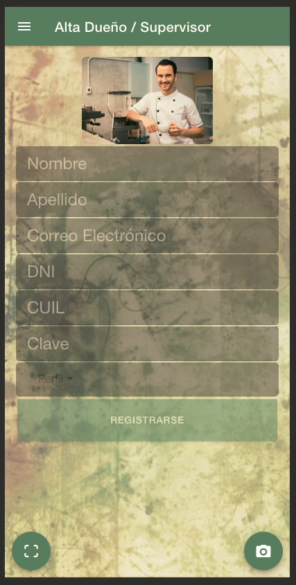
      <li>Alta de empleados - Marcos Cardona - marcos</li>
      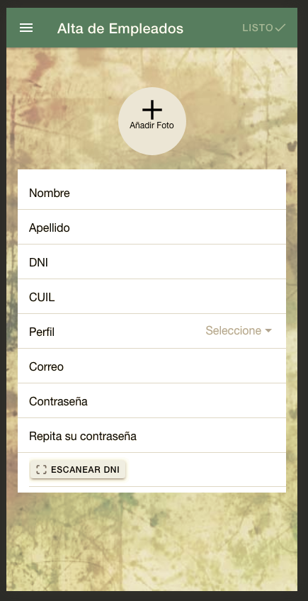
      <li>Alta de productos (platos y bebidas) - Gastón Pesoa - gaston</li>
      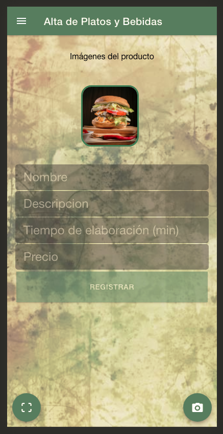
      <li>Alta de Mesa - Marcos Cardona - marcos</li>
      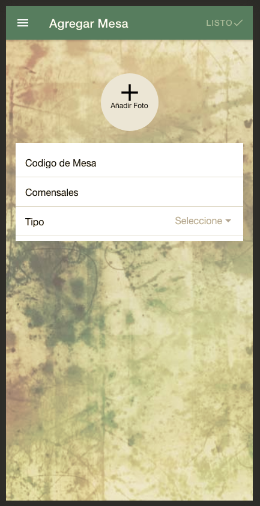
    </ul>
  </li>
</ol>

 

<b>
Sprint 2 2/11 - 9/11
</b>
<ol>
  <li>Correcciones primer sprint
    <ul>
      <li>Validaciones en inputs altas - Gastón Pesoa - gaston</li>
      <li>Contrastes y estilos de inputs y textos - Gastón Pesoa - gaston</li>
    </ul>
  </li>
  <li>Listado de usuarios pendientes de alta - Augusto Morelli - augustoBranch</li>
  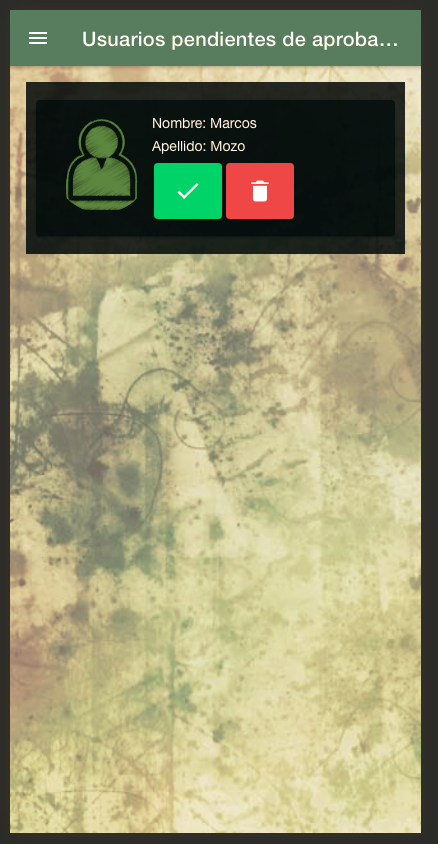
  <li>Notificación por mail al cliente confirmando ser aceptado o rechazado - Augusto Morelli - augustoBranch</li>
  <li>Validaciones de ingreso a la aplicación - Augusto Morelli - augustoBranch</li>
</ol>

 

<b>
Sprint 3 9/11 - 16/11
</b>
<ol>
<li>Ingreso anónimo - Augusto Morelli - augustoBranch</li>
  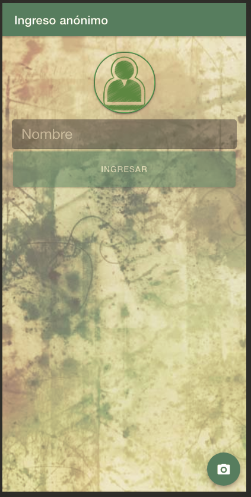
  <li>Gestión
  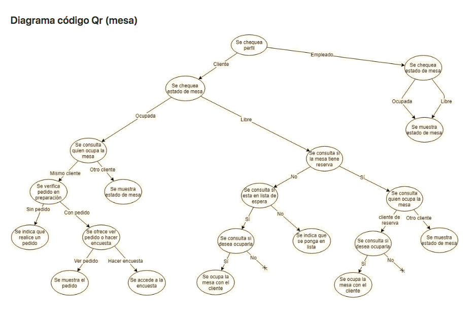
    <ul>
      <li>Leer QR de ingreso al local y poner en lista de espera - Augusto Morelli - augustoBranch</li>
      <li>Aceptar ingreso del cliente como mozo - Marcos Cardona - marcos</li>
      <li>Validación de no poder tomar mesa sin estar en la lista de espera previamente - Augusto Morelli - augustoBranch</li>
      <li>Validación de que al tener una mesa asignada no se le pueda asignar a otro - Augusto Morelli - augustoBranch</li>
    </ul>
  </li>
  <li>Hacer reservas agendadas - Augusto Morelli - augustoBranch</li>
</ol>

 

<b>
Sprint 4 16/11 - 23/11 - Preentrega
</b>
<ol>
  <li>Gestión
    <ul>
      <li>Listado de los productos disponibles con detalle y precio - Gastón Pesoa - gaston</li>
      <li>Alta de pedido, platos, bebidas - Gastón Pesoa - gaston</li>
      <li>Confirmación del pedido por el mozo y derivación al sector correspondiente - Marcos Cardona - marcos</li>
      <li>Acceso a la encuesta y al estado del pedido por parte del cliente en todo momento desde que genera el pedido - Augusto Morelli - augustoBranch</li>
      <li>Listado de productos para cada sector (cocina, barra) según el tipo de pedido - Marcos Cardona - marcos</li>
      <li>Confirmación de pedido preparado por cada sector y retorno al mozo validando que estee listo por todas las partes para que haga la entrega - Marcos Cardona - marcos</li>
      <li>Confirmación de la entrega por parte del mozo - Marcos Cardona - marcos</li>
      <li>Confirmación de la recepción del pedido por parte del cliente - Augusto Morelli - augustoBranch</li>
      <li>Acceso a la opción de pedido de cuenta por parte del cliente - Augusto Morelli - augustoBranch</li>
      <li>Detalle de la cuenta con: los pedidos realizados (con precios unitarios), importe de cada pedido, grado de satisfaccion del cliente (propina) e importe TOTAL - Augusto Morelli - augustoBranch</li>
      <li>Confirmación del pago y liberación de la mesa por parte del mozo - Marcos Cardona - marcos</li>
    </ul>
  </li>
  <li>Configuración de Servicios
    <ul>
    <li>Empleados - Marcos Cardona - marcos</li>
    <li>Mesas - Augusto Morelli - augustoBranch</li>
    <li>Pedido - Gastón Pesoa - gaston</li>
    <li>Producto - Gastón Pesoa - gaston</li>
    <li>Reservas - Augusto Morelli - augustoBranch</li>
    <li>Toast - Gastón Pesoa - gaston</li>
    <li>Tomar pedido - Marcos Cardona - marcos</li>
  </ul>
  </li>
  <li>Pruebas de funcionalidad del circuito general en conjunto</li>
</ol>

 

<b>
Sprint 5 23/11 - 30/11 - Entrega
</b>
<ol>
<li>Correcciones generales
    <ul>
      <li>QR de DNI que acepten dos formatos - Augusto Morelli - augustoBranch</li>
      <li>Error lectura de datos DNI con QR - Augusto Morelli - augustoBranch</li>
      <li>Validación de cargar fotos de usuario en el registro - Augusto Morelli - augustoBranch</li>
      <li>Home con información no necesario y mayor comprención de los textos - Gastón Pesoa - gaston</li>
      <li>Quitar de la lista de espera de confirmación de registro los usuarios ya confirmados o rechazados - Marcos Cardona - marcos</li>
      <li>Alta de pedido con mayor detalle e interactividad con el usuario, precios constantemente e imágenes de los productos - Gastón Pesoa - gaston</li>
      <li>Listado de pedidos del mozo con mayor información y número de mesa - Marcos Cardona - marcos</li>
      <li>Al cerrar pedido borrarlo de la lista de espera - Gastón Pesoa - gaston</li>
      <li>Propina - Augusto Morelli - augustoBranch</li>
    </ul>
    <li>Pruebas de funcionalidad del circuito general en conjunto</li>
  </li>
</ol>

 

